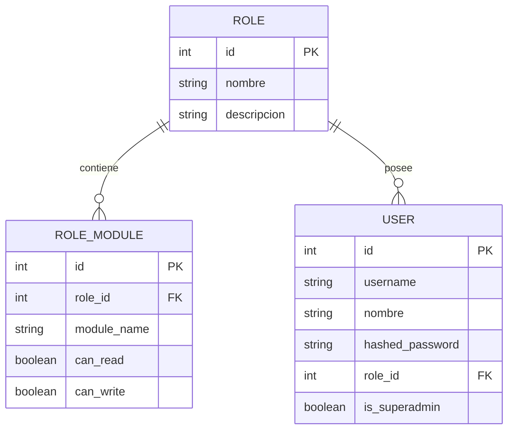
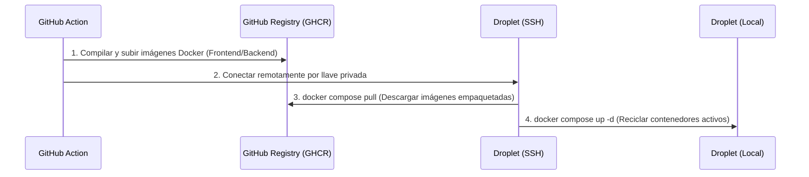

# Documentación Técnica: NetTrack CMDB & ITAM Operations

NetTrack es una plataforma de Gestión de Infraestructura de Red y Control de Activos (ITAM / CMDB) desacoplada, diseñada para mapear la infraestructura lógica y física de plantas industriales, simular caídas en cascada (Gemelo Digital) y gestionar ingresos y egresos de almacén.

---

## 1. Arquitectura del Sistema

El sistema utiliza una arquitectura de tres capas desacopladas, completamente dockerizadas para garantizar la paridad absoluta entre entornos locales y de producción.


### Tecnologías Clave
*   **Frontend**: Vue 3 (Composition API), Vite, Axios (con interceptores globales), Tailwind CSS v3 (procesado mediante PostCSS).
*   **Backend**: FastAPI (Python 3.10+), SQLAlchemy ORM, Uvicorn (ASGI), ReportLab (Generación de PDF).
*   **Base de Datos**: PostgreSQL 15.
*   **Orquestación y Servidor Web**: Docker, Docker Compose, Nginx.

---

## 2. Estructura del Repositorio

```
cmdb/
├── backend/
│   ├── app/
│   │   ├── config.py           # Configuración de variables de entorno y JWT
│   │   ├── database.py         # Configuración del motor SQLAlchemy y sesión
│   │   ├── models.py           # Modelos relacionales de PostgreSQL
│   │   ├── schemas.py          # Esquemas Pydantic para validación y serialización
│   │   ├── crud.py             # Lógica transaccional y hash de contraseñas
│   │   ├── main.py             # Endpoints del sistema y Middleware de Seguridad
│   │   ├── simulator.py        # Algoritmo de caída en cascada (Gemelo Digital)
│   │   └── pdf_generator.py    # Generador de Remitos y Actas de Entrega
│   ├── Dockerfile
│   └── requirements.txt
├── frontend/
│   ├── src/
│   │   ├── assets/
│   │   │   └── style.css       # Hoja de estilos global con Tailwind @apply
│   │   ├── components/
│   │   │   ├── Dashboard.vue        # Métricas KPI y estado general
│   │   │   ├── ImpactSimulator.vue  # Simulador gráfico de dependencias
│   │   │   ├── ITAMPanel.vue        # Registro de inventario y consumo
│   │   │   ├── DataCRUD.vue         # ABM unificado de activos de red
│   │   │   ├── UsuariosRoles.vue    # Panel de administración de RBAC
│   │   │   └── Login.vue            # Tarjeta de autenticación de usuario
│   │   ├── App.vue             # Componente raíz y control de vistas
│   │   └── main.js             # Inicialización de la aplicación Vue
│   ├── tailwind.config.js      # Configuración de Tailwind CSS v3
│   ├── postcss.config.js       # Procesamiento de Tailwind
│   ├── package.json
│   └── Dockerfile
├── docker-compose.yml          # Orquestador de contenedores
└── .github/workflows/
    └── deploy.yml              # Pipeline CI/CD GitHub Actions
```

---

## 3. Modelo de Datos y Seguridad (RBAC)

La base de datos cuenta con tablas operativas de infraestructura de red y tres tablas específicas para el control de acceso basado en roles (**RBAC**):



### Tabla de Permisos por Defecto
El sistema cuenta con semillado automático en el arranque si las tablas de seguridad están vacías:

| Rol | Módulos Autorizados | Lectura (Read) | Escritura (Write) | Propósito |
| :--- | :--- | :---: | :---: | :--- |
| **Superadmin** | *(Bypass de seguridad total)* | Sí | Sí | Control absoluto del sistema y administración de usuarios |
| **Operador** | `dashboard`, `simulator`, `itam`, `crud` | Sí | Sí | Operaciones del día a día, carga de activos y remitos |
| **Lector** | `dashboard`, `simulator`, `itam`, `crud` | Sí | No | Auditoría visual, consulta de stock y simulación de cortes |

---

## 4. Control de Seguridad y Autorización

### Middleware Interceptor Global (`main.py`)
Toda solicitud HTTP entrante al backend (excepto el login y el health check) es interceptada por la dependencia global `check_global_permission`. Esta lógica actúa como un firewall a nivel de base de datos:

1.  **Extracción del Token**: Lee la cabecera `Authorization: Bearer <JWT>`.
2.  **Validación JWT**: Verifica la firma con la clave `SECRET_KEY` y valida la expiración.
3.  **Verificación de Superusuario**: Si `user.is_superadmin == True`, autoriza la petición inmediatamente (Bypass total).
4.  **Verificación Administrativa**: Si la ruta apunta a `/api/usuarios` o `/api/roles`, bloquea a cualquier usuario que no sea superadministrador.
5.  **Mapeo de Ruta a Módulo**: Traduce la URL solicitada al módulo correspondiente:
    *   `/api/simulator` $\rightarrow$ Módulo `simulator`
    *   `/api/inventario`, `/api/consumibles` $\rightarrow$ Módulo `itam`
    *   `/api/subestaciones`, `/api/hosts`, `/api/marcas`, etc. $\rightarrow$ Módulo `crud`
6.  **Verificación de Operación (Lectura/Escritura)**:
    *   Métodos **`GET`** requieren que `can_read == True` en base de datos.
    *   Métodos **`POST`**, **`PUT`**, **`DELETE`** requieren que `can_write == True`.

Si alguna validación falla, retorna inmediatamente **HTTP 401 (Unauthorized)** o **HTTP 403 (Forbidden)**.

---

## 5. Frontend y Diseño Responsivo (Tailwind CSS v3)

El frontend utiliza una estrategia híbrida para integrar Tailwind CSS v3 de forma limpia y mantenible:

*   **Tipografía**: Se inyecta la fuente moderna **Inter** desde Google Fonts.
*   **Directiva `@apply`**: Se mapean las clases semánticas nativas a clases utilitarias de Tailwind en [`style.css`](file:///home/ariel/Desarrollos/apps/cmdb/frontend/src/assets/style.css). Esto previene que los archivos `.vue` se llenen de código inline ilegible:
    *   `.form-control`: Aplica bordes finos, foco estilizado y transiciones a inputs.
    *   `.custom-table`: Genera tablas tipo cebra corporativas responsivas.
    *   `.btn`: Unifica las dimensiones físicas y micro-sombras de los botones.
*   **Layout Responsivo**:
    *   A partir de un ancho menor o igual a **`992px`**, el menú lateral se reubica automáticamente en formato horizontal superior, las grillas de dos y tres columnas colapsan a una única columna vertical, y los márgenes se compactan para un uso cómodo en pantallas móviles.

---

## 6. Despliegue y CI/CD

El proyecto se despliega de manera automatizada a través de GitHub Actions en un Droplet de Digital Ocean.

### Pipeline de Despliegue (`.github/workflows/deploy.yml`)
El flujo garantiza que **nunca se compila código en caliente dentro del Droplet**, protegiendo los recursos de cpu y memoria del servidor remoto:



---

## 7. Instrucciones de Uso y Mantenimiento

### Ejecución Local (Desarrollo/Pruebas)
1.  Asegúrate de contar con Docker y Docker Compose instalados.
2.  Levanta los contenedores con:
    ```bash
    docker compose up -d
    ```
3.  Accede a la interfaz web en: `http://localhost:8088`.
4.  Para ver los logs del backend en tiempo real:
    ```bash
    docker compose logs backend -f
    ```

### Limpieza de Base de Datos
En entorno local de desarrollo, el esquema público de la base de datos PostgreSQL se limpia y recrea de forma automática en cada arranque para mantener la coherencia del semillado de datos de prueba.
