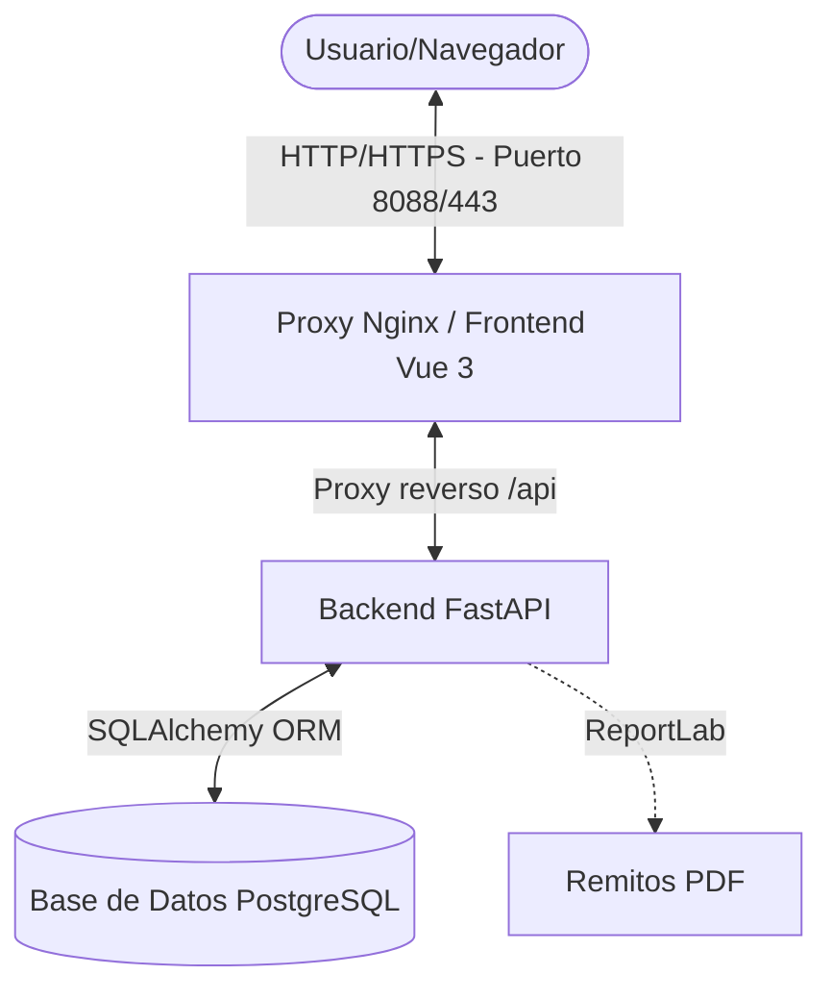
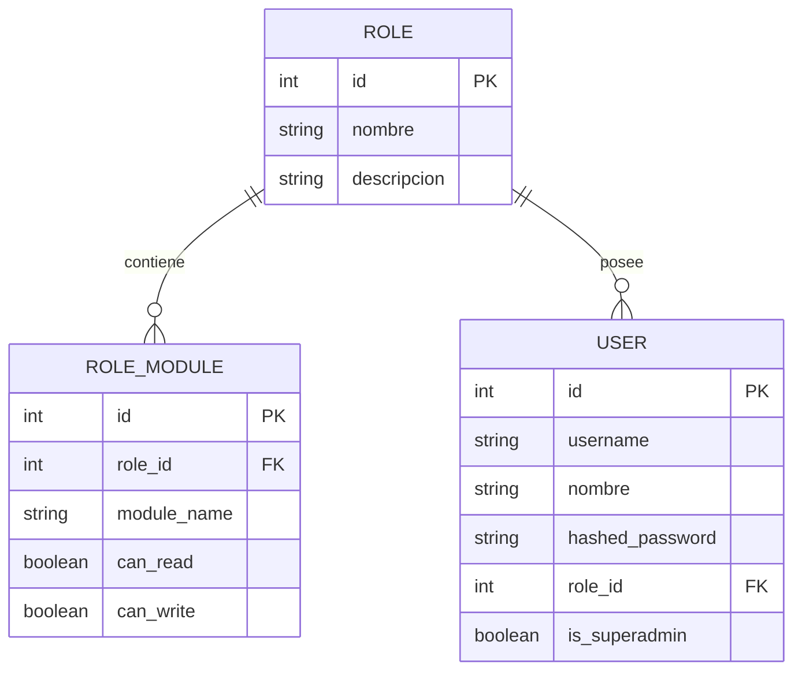
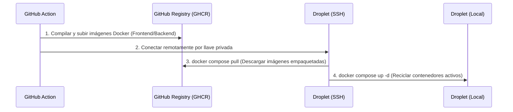

# Documentación Técnica: NetTrack CMDB & ITAM Operations

NetTrack es una plataforma de Gestión de Infraestructura de Red y Control de Activos (ITAM / CMDB) desacoplada, diseñada para mapear la infraestructura lógica y física de plantas industriales, simular caídas en cascada (Gemelo Digital) y gestionar ingresos y egresos de almacén.

---

## 1. Arquitectura del Sistema

El sistema utiliza una arquitectura de tres capas desacopladas, completamente dockerizadas para garantizar la paridad absoluta entre entornos locales y de producción.



### Tecnologías Clave
*   **Frontend**: Vue 3 (Composition API), Vite, Axios (con interceptores globales), Tailwind CSS v3 (procesado mediante PostCSS).
*   **Backend**: FastAPI (Python 3.10+), SQLAlchemy ORM, Uvicorn (ASGI), ReportLab (Generación de PDF).
*   **Base de Datos**: PostgreSQL 15.
*   **Orquestación y Servidor Web**: Docker, Docker Compose, Nginx.

---

## 2. Estructura del Repositorio

```
cmdb/
├── backend/
│   ├── app/
│   │   ├── config.py           # Configuración de variables de entorno y JWT
│   │   ├── database.py         # Configuración del motor SQLAlchemy y sesión
│   │   ├── models.py           # Modelos relacionales de PostgreSQL
│   │   ├── schemas.py          # Esquemas Pydantic para validación y serialización
│   │   ├── crud.py             # Lógica transaccional y hash de contraseñas
│   │   ├── main.py             # Endpoints del sistema y Middleware de Seguridad
│   │   ├── simulator.py        # Algoritmo de caída en cascada (Gemelo Digital)
│   │   ├── data_tools.py       # Importación, exportación y backups en XLS/CSV
│   │   └── pdf_generator.py    # Generador de Remitos y Actas de Entrega
│   ├── Dockerfile
│   └── requirements.txt
├── frontend/
│   ├── src/
│   │   ├── assets/
│   │   │   └── style.css       # Hoja de estilos global con Tailwind @apply
│   │   ├── components/
│   │   │   ├── Dashboard.vue        # Métricas KPI y estado general
│   │   │   ├── ImpactSimulator.vue  # Simulador gráfico de dependencias
│   │   │   ├── ITAMPanel.vue        # Registro de inventario y consumo
│   │   │   ├── DataCRUD.vue         # ABM unificado de activos de red
│   │   │   ├── UsuariosRoles.vue    # Panel de administración de RBAC
│   │   │   ├── DataTools.vue        # Panel de importación, exportación y backups
│   │   │   └── Login.vue            # Tarjeta de autenticación de usuario
│   │   ├── App.vue             # Componente raíz y control de vistas
│   │   └── main.js             # Inicialización de la aplicación Vue
│   ├── tailwind.config.js      # Configuración de Tailwind CSS v3
│   ├── postcss.config.js       # Procesamiento de Tailwind
│   ├── package.json
│   └── Dockerfile
├── docker-compose.yml          # Orquestador de contenedores
└── .github/workflows/
    └── deploy.yml              # Pipeline CI/CD GitHub Actions
```

---

## 3. Modelo de Datos y Seguridad (RBAC)

La base de datos cuenta con tablas operativas de infraestructura de red y tres tablas específicas para el control de acceso basado en roles (**RBAC**):



### Tabla de Permisos por Defecto
El sistema cuenta con semillado automático en el arranque si las tablas de seguridad están vacías:

| Rol | Módulos Autorizados | Lectura (Read) | Escritura (Write) | Propósito |
| :--- | :--- | :---: | :---: | :--- |
| **Superadmin** | *(Bypass de seguridad total)* | Sí | Sí | Control absoluto del sistema y administración de usuarios |
| **Operador** | `dashboard`, `simulator`, `itam`, `crud` | Sí | Sí | Operaciones del día a día, carga de activos y remitos |
| **Lector** | `dashboard`, `simulator`, `itam`, `crud` | Sí | No | Auditoría visual, consulta de stock y simulación de cortes |

---

## 4. Control de Seguridad y Autorización

### Middleware Interceptor Global (`main.py`)
Toda solicitud HTTP entrante al backend (excepto el login y el health check) es interceptada por la dependencia global `check_global_permission`. Esta lógica actúa como un firewall a nivel de base de datos:

1.  **Extracción del Token**: Lee la cabecera `Authorization: Bearer <JWT>`.
2.  **Validación JWT**: Verifica la firma con la clave `SECRET_KEY` y valida la expiración.
3.  **Verificación de Superusuario**: Si `user.is_superadmin == True`, autoriza la petición inmediatamente (Bypass total).
4.  **Verificación Administrativa**: Si la ruta apunta a `/api/usuarios` o `/api/roles`, bloquea a cualquier usuario que no sea superadministrador.
5.  **Mapeo de Ruta a Módulo**: Traduce la URL solicitada al módulo correspondiente:
    *   `/api/simulator` $\rightarrow$ Módulo `simulator`
    *   `/api/inventario`, `/api/consumibles` $\rightarrow$ Módulo `itam`
    *   `/api/subestaciones`, `/api/hosts`, `/api/marcas`, `/api/data` (Importaciones y Exportaciones), etc. $\rightarrow$ Módulo `crud`
6.  **Verificación de Operación (Lectura/Escritura)**:
    *   Métodos **`GET`** requieren que `can_read == True` en base de datos.
    *   Métodos **`POST`**, **`PUT`**, **`DELETE`** requieren que `can_write == True`.

Si alguna validación falla, retorna inmediatamente **HTTP 401 (Unauthorized)** o **HTTP 403 (Forbidden)**.

### Control de Acceso Granular por Ámbito/Dominio de Activos

Para asegurar la correcta segregación de funciones entre los equipos de Redes (IT/Network), Mantenimiento de Edificios/Energía (Facilities), y Planta Industrial (OT/Shopfloor), se ha integrado un control de seguridad por ámbito a nivel de registro:

1.  **Ámbitos Soportados**:
    *   `NETWORK`: Redes de datos e IT corporativo.
    *   `FACILITIES`: Sistemas de energía, UPS, subestaciones y cámaras.
    *   `SHOPFLOOR`: Dispositivos de automatización industrial, PLC, HMI y PC de control.
2.  **Propiedades de Usuario y Activo**:
    *   Cada equipo (`Host`, `UPS`, `Switch`, `Servidor`) e insumo (`StockConsumible`) posee la columna `dominio`.
    *   Cada `User` posee la propiedad `dominio_asignado` (`ALL` para superadministradores y roles globales, o uno de los ámbitos específicos).
3.  **Restricciones de Lectura**:
    *   Los endpoints CRUD `/api/hosts`, `/api/switches`, `/api/ups`, `/api/servidores` y `/api/consumibles` inyectan automáticamente filtros en base de datos (`query.filter(models.Host.dominio == user.dominio_asignado)`) para que un operador de un dominio solo pueda leer elementos asignados a su mismo dominio.
    *   El listado consolidado `/api/inventario/consolidado` y las alertas de ciclo de vida `/api/v1/itam/lifecycle/alerts` también aplican este filtrado dinámicamente.
4.  **Restricciones de Escritura y Edición**:
    *   Al enviar peticiones `POST` (creación), `PUT` (actualización), `DELETE` (eliminación), o registro de mantenimiento preventivo/correctivo, el backend comprueba que el dominio del objeto coincida con el dominio del operador. De lo contrario, la mutación se bloquea devolviendo **HTTP 403 Forbidden**.
5.  **Visualización en Gemelo Digital (Simulador)**:
    *   Los operadores de dominio restringido (ej: `SHOPFLOOR`) pueden cargar y visualizar la topología completa en planos (incluyendo switches o UPS "aguas arriba" en otros dominios necesarios para entender la conectividad lógica), pero estos elementos extranjeros se marcan con la bandera `readonly: true` en la API y aparecen en el mapa con un candado de seguridad 🔒. No se pueden arrastrar, posicionar, reubicar ni eliminar del plano.

---

## 5. Frontend y Diseño Responsivo (Tailwind CSS v3)

El frontend utiliza una estrategia híbrida para integrar Tailwind CSS v3 de forma limpia y mantenible:

*   **Tipografía**: Se inyecta la fuente moderna **Inter** desde Google Fonts.
*   **Directiva `@apply`**: Se mapean las clases semánticas nativas a clases utilitarias de Tailwind en [`style.css`](file:///home/ariel/Desarrollos/apps/cmdb/frontend/src/assets/style.css). Esto previene que los archivos `.vue` se llenen de código inline ilegible:
    *   `.form-control`: Aplica bordes finos, foco estilizado y transiciones a inputs.
    *   `.custom-table`: Genera tablas tipo cebra corporativas responsivas.
    *   `.btn`: Unifica las dimensiones físicas y micro-sombras de los botones.
*   **Layout Responsivo**:
    *   A partir de un ancho menor o igual a **`992px`**, el menú lateral se reubica automáticamente en formato horizontal superior, las grillas de dos y tres columnas colapsan a una única columna vertical, y los márgenes se compactan para un uso cómodo en pantallas móviles.
*   **Paginación y Filtros Interactivos (ITAM)**:
    *   Tanto el listado de consolidado de equipos como el catálogo de stock de consumibles implementan lógica de paginación del lado del cliente con tamaño de página configurable, campos de búsqueda interactiva (por marca/modelo) y filtros de categoría reactivos. Esto garantiza un acceso fluido a registros masivos sin saturar la comunicación con la API.

---

## 6. Despliegue y CI/CD

El proyecto se despliega de manera automatizada a través de GitHub Actions en un Droplet de Digital Ocean.

### Pipeline de Despliegue (`.github/workflows/deploy.yml`)
El flujo garantiza que **nunca se compila código en caliente dentro del Droplet**, protegiendo los recursos de cpu y memoria del servidor remoto:



---

## 7. Instrucciones de Uso y Mantenimiento

### Ejecución Local (Desarrollo/Pruebas)
1.  Asegúrate de contar con Docker y Docker Compose instalados.
2.  Levanta los contenedores con:
    ```bash
    docker compose up -d
    ```
3.  Accede a la interfaz web en: `http://localhost:8088`.
4.  Para ver los logs del backend en tiempo real:
    ```bash
    docker compose logs backend -f
    ```

### Limpieza de Base de Datos
En entorno local de desarrollo, el esquema público de la base de datos PostgreSQL se limpia y recrea de forma automática en cada arranque para mantener la coherencia del semillado de datos de prueba.

---

## 8. Integración con Checkmk (Monitoreo e Impacto)

NetTrack expone un endpoint receptor de webhooks diseñado para integrarse directamente con las notificaciones de alertas de **Checkmk**, vinculándolas con el Gemelo Digital en el plano de planta.

### Mapeo de Identificadores y Persistencia
Para vincular los hosts físicos con la CMDB de NetTrack, se utiliza la columna `checkmk_host_id` en la tabla `hosts` (configurable desde la UI en la grilla de administración de datos):
1. Al recibir un webhook, busca coincidencia de `host_name` contra `checkmk_host_id` y realiza fallback a `nombre` si no existe.
2. **Actualización de Estado**: Si la alerta es `DOWN` o `CRITICAL`, el backend actualiza su `estado_id` en la base de datos a `3` ("Crítico"). Si la alerta es `UP`, se restablece a `1` ("Ok").

### Propagación de Fallas Recursiva (Cascada en BD)
Cuando se recibe una alerta de caída (`DOWN` o `CRITICAL`):
- El webhook calcula recursivamente todos los switches, servidores y hosts lógicos dependientes aguas abajo mediante el algoritmo BFS de [simulator.py](file:///home/ariel/Desarrollos/apps/cmdb/backend/app/simulator.py).
- **Propagación en Base de Datos**: Marca automáticamente todos los equipos de la cascada afectada como `3` ("Crítico") en PostgreSQL. Al recuperarse el dispositivo origen (`UP`), el webhook restaura todo el árbol afectado a `1` ("Ok").

### Endpoint del Webhook
*   **Ruta**: `POST /api/v1/integrations/checkmk/webhook`
*   **Seguridad**: Bypass del middleware JWT (exenta de autorización).
*   **Payload Aceptado**:
    ```json
    {
      "host_name": "SW-CORE",
      "host_state": "DOWN",
      "service_state": null
    }
    ```

### Visualización en el Plano (Modo Tiempo Real vs. Modo Edición)
En la pestaña de planos, el sistema consulta dinámicamente los cambios de estado cada **4 segundos** (polling selectivo):
- **`📡 Tiempo Real` (Default)**: Muestra en segundos si un equipo cae pintándolo de color rojo pulsante con el ícono `⚠️` de advertencia. En este modo el arrastre está deshabilitado para evitar reinicios de posición durante el refresco.
- **`✍️ Modo Edición`**: Suspende el refresco automático y habilita las capacidades drag & drop. Al hacer clic en "Guardar Distribución", se guardan las coordenadas en base de datos y se regresa al modo de monitoreo.

---

## 9. Gestión de Ciclo de Vida y Garantías (ITAM)

NetTrack incorpora un panel de **Ciclo de Vida & Alertas Preventivas** para el control del envejecimiento tecnológico del hardware y los vencimientos de contratos de soporte o garantías.

### Columnas de Base de Datos
La tabla unificada `hosts` cuenta con campos específicos de ciclo de vida (editables vía API o por medio del modal de edición del panel):
*   `fecha_instalacion` (Date)
*   `ultimo_mantenimiento` (Date)
*   `proximo_mantenimiento` (Date)
*   `proximo_cambio_baterias` (Date) - Específico para UPS
*   `fecha_eol` (Date) - Fin de Vida / EOS
*   `fin_garantia_contrato` (Date) - Expiración de contrato de soporte
*   `proveedor_soporte` (String)
*   `numero_contrato` (String)

### Endpoint de Alertas de Ciclo de Vida
*   **Ruta**: `GET /api/v1/itam/lifecycle/alerts`
*   **Propósito**: Recopila todos los activos de hardware y calcula su **Estado de Salud de Ciclo de Vida** dinámicamente comparando la fecha de hoy con los vencimientos configurados:
    - **`VENCIDO/CRITICO` (Rojo)**: Si la fecha de mantenimiento, baterías, garantía o EOL ya se encuentra en el pasado.
    - **`PROXIMO_A_VENCER` (Amarillo)**: Si falta menos de 60 días para el mantenimiento/baterías, o menos de 90 días para EOL o vencimiento de garantía.
    - **`VIGENTE` (Verde)**: Si todas las fechas están al día.

### Interfaz Gráfica (ITAM)
El módulo se expone en la pestaña **Ciclo de Vida & Alertas**:
1.  **Tarjetas KPI**: Resumen cuantitativo de alertas de baterías, mantenimientos, EOL y garantías/contratos vencidos o a vencer.
2.  **Tabla de Semáforos**: Listado filtrable por color de salud (Rojo, Amarillo, Verde) con búsqueda reactiva.
3.  **Exportación a CSV**: Permite descargar la tabla de alertas filtradas como archivo CSV plano inmediatamente.
4.  **Edición Rápida**: Modal interactivo integrado que sanitiza las fechas vacías a `null` para cumplir con las validaciones de tipos de Pydantic.

---

## 10. Módulo de Registro de Mantenimientos (Órdenes de Trabajo)

Se incluye un módulo transaccional para auditar todas las intervenciones técnicas realizadas sobre los activos de hardware.

### Modelo de Datos `Mantenimiento`
Asociado a la tabla `mantenimientos`, almacena el historial de ejecuciones técnicas:
*   `id` (Integer, PK)
*   `host_id` (Integer, FK a `hosts.id`, cascada al borrar)
*   `usuario_id` (Integer, FK a `users.id`, NULL al borrar usuario)
*   `tipo` (String: `'PREVENTIVO'`, `'CORRECTIVO'`, `'CAMBIO_BATERIA'`)
*   `fecha_ejecucion` (DateTime, default ahora)
*   `descripcion_trabajo` (Text)
*   `tecnico_responsable` (String)
*   `costo` (Float, opcional)
*   `proxima_fecha_sugerida` (Date, opcional)

### Lógica Transaccional (Actualización Atómica)
Al insertar un nuevo registro mediante `POST /api/v1/itam/mantenimientos`:
1.  **Actualización de Fechas**:
    *   Si es `CAMBIO_BATERIA`, se actualiza `fecha_cambio_baterias` al día de hoy y `proximo_cambio_baterias` a `proxima_fecha_sugerida`.
    *   Si es `PREVENTIVO` o `CORRECTIVO`, se actualiza `ultimo_mantenimiento` al día de hoy y `proximo_mantenimiento` a `proxima_fecha_sugerida`.
2.  **Recuperación de Estado**: Si se marca la casilla `restablecer_estado`, se actualiza de manera automática el `estado_id` del activo en la tabla `hosts` a `"Ok"` (eliminando la alerta crítica/falla).
3.  Toda la operación se confirma en una única transacción de base de datos (`db.commit()`).

### Endpoints de API
*   **`POST /api/v1/itam/mantenimientos`**: Registra la orden de trabajo y actualiza el host. Requiere rol con permisos de escritura en el módulo `itam`.
*   **`GET /api/v1/itam/hosts/{host_id}/mantenimientos`**: Devuelve el historial ordenado de forma descendente por fecha.

### Componentes en el Frontend
*   **Botón "Mant."**: Ubicado en cada celda del listado de Ciclo de Vida para registrar intervenciones rápidas.
*   **Pestaña "Historial de Mantenimientos"**: Muestra una línea de tiempo (Timeline) de los trabajos realizados por equipo, con códigos de color de semáforo dependiendo del tipo de mantenimiento (Naranja: Baterías, Rojo: Correctivo, Verde: Preventivo).
*   **Modal de Carga**: Formulario emergente para cargar los datos del técnico, costos, y reprogramar la próxima fecha sugerida de mantenimiento.


